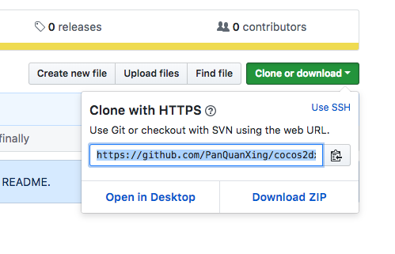

# cocos2djs小作品——捕捉小星星

<center>

<br/>
<font color="Gray">作者：潘全星   日期：2018-02-12</font>
</center>
**cocos2dx** 是一款流行的2d游戏引擎，融合了Cocos2d-HTML5和Cocos2d-x JavaScript Bindings（[JSB](http://www.cocos2d-x.org/docs/api-ref/cplusplus/v3x/d6/d1e/group__jsb.html)），封装成原生javascript扩平台引擎 **cocos2djs** 。基于谷歌v8引擎的js也同样具有跨平台特性。cocos2djs官网提供待完善的[**文档**](http://www.cocos2d-x.org/docs/api-ref/js/v3x/)。 

## clone“捕捉小星星”到你的Disk
打开terminal(命令行终端)，此时你位于系统的～目录下，运行命令：

```
cd ~/Desktop
mkdir project_folder
```

在桌面上创建一个`project_folder`文件夹。

获取Git Server URL:


初始化本地git仓库，同时将远程Git Server URL加入到Git Config文件中,运行命令：

```
git init
git remote add -f origin https://github.com/PanQuanXing/cocos2dxJSProjects.git
```

在Config中允许使用Sparse Checkout 模式，来拣出一个大远程仓库中的个别文件，分别添加到`.git/info/sparse-checkout`文件中：

```
git config core.sparsecheckout true
echo "helloGame" >> .git/info/sparse-checkout
```

最后，你只需以正常方式从你想要的分支中将你的项目拉下来就可以了：

`git pull origin master`

## 安装cocos creator
先在官网[注册cocos开发者账号](https://passport.cocos.com/auth/signup)，然后[下载对应系统版本的安装包](http://www.cocos.com/download)。最后安装即可，最新版是V1.8.1。

## 导入已有项目
安装好后，打开cocos creator,用注册者账户登录后，点主界面的`Dashboard`下的`打开其他项目...`,定位到文件夹`project_folder`即可

## 其他：通过NodeJs程序实现Github选择性clone
```
const execSync = require('child_process').execSync
const fs=require('fs');

const cmd1 = 'git init';
var cmd2 = 'git remote add -f origin ';
const cmd3 = 'git config core.sparsecheckout true';
const cmd4='git pull origin master';

var Path='';
process.stdin.setEncoding('utf8');
process.stdout.write('请输入仓库远程地址，以及想要复制的文件路径？两个输入以及多个路径都用空格分开:\n');
process.stdin.on('data',(data)=>{
    cmd2+=data.split(' ')[0];
    Path=data.slice(data.indexOf(' ')+1).split(' ').join('\n');
    process.stdin.emit('end');
});

process.stdin.on('end',()=>{
    execSync(cmd1);
    execSync(cmd2);
    execSync(cmd3);

    fs.writeFileSync('./.git/info/sparse-checkout',Path);
    execSync(cmd4)
    console.log('It\'s ok!');

});
```

启动程序后，例如输入：

`https://github.com/accforgit/React-project-By-TDD.git assets/css index.html`

程序就会自动将你所指定的一个文件夹和一个html文件拉取下来。